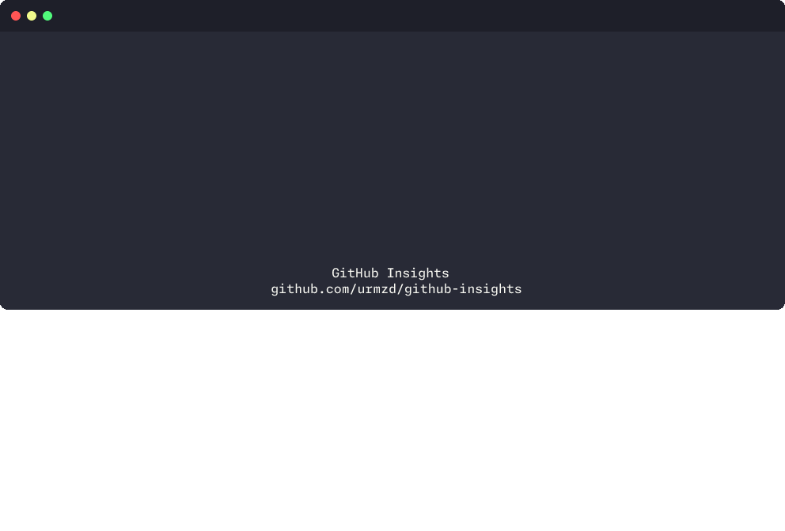

<p align="center">
  <h1 align="center">GitHub Insights</h1>
  <p align="center">
    Generate beautiful SVG insights visualizations for your GitHub profile README.
    <br /><br />
    <a href="https://github.com/urmzd/github-insights/releases">Install</a>
    &middot;
    <a href="https://github.com/urmzd/github-insights/issues">Report Bug</a>
    &middot;
    <a href="https://github.com/urmzd">Profile Demo</a>
  </p>
</p>

<p align="center">
  <a href="https://github.com/urmzd/github-insights/actions/workflows/ci.yml"></a>
  <a href="https://www.npmjs.com/package/@urmzd/github-insights"></a>
  &nbsp;
  <a href="LICENSE"></a>
</p>

## Showcase

<table>
<tr>
<td width="50%" align="center"><strong>SVG Output</strong></td>
<td width="50%" align="center"><strong>CLI / TUI</strong></td>
</tr>
<tr>
<td></td>
<td></td>
</tr>
</table>

Run `github-insights generate` locally for a full TUI experience with live phase tracking, spinners, and timing for each pipeline step.

## Contents

- [Features](#features)
- [Quick Start](#quick-start)
- [Configuration](#configuration)
- [AI Features](#ai-features)
- [Sections](#sections)
- [Local Development](#local-development)
- [Output Files](#output-files)
- [Agent Skill](#agent-skill)
- [License](#license)

## Features

- **Composable sections** — pick and order sections (`spotlight`, `velocity`, `rhythm`, `constellation`, `portfolio`, `impact`) or use a preset
- **Spotlight** — surfaces your top projects ranked by AI analysis (activity, relevance, impact)
- **Language Velocity** — streamgraph showing how your language usage has evolved over the past year
- **Contribution Rhythm** — radar chart revealing day-of-week commit patterns, plus stats (commits, PRs, reviews, streak)
- **Project Constellation** — visual map of projects positioned by language ecosystem and complexity, with connections between related repos
- **Portfolio** — full project list in a collapsible `<details>` tag, grouped by AI-classified category
- **Open Source Impact** — external contributions sorted by repo star count with logarithmic impact bars
- **AI preamble generation** — auto-generated profile introduction (or supply your own `PREAMBLE.md`)
- **AI project classification** — repos classified by status (active/maintained/inactive) and purpose (Developer Tools/SDKs/Applications/Research)
- **CLI / TUI** — local generation with an interactive terminal UI (Ink-based), live progress, and phase timing; powered by [Commander](https://www.npmjs.com/package/commander) with `init` and `generate` subcommands
- **Configurable AI prompts** — override model, temperature, and prompt text per AI task via the `ai:` config block; prompts can be inline strings or paths to `.txt`/`.md` files
- **Config validation** — `github-insights.yml` (or `.yaml` / `.toml`) validated with [Zod](https://www.npmjs.com/package/zod); invalid values are silently ignored with sensible defaults
- **Exclude archived repos** — archived repositories are excluded from the portfolio by default (`exclude_archived: true`)
- **Social badges** — auto-detected from your GitHub profile (website, Twitter, LinkedIn, etc.)
- **Dual theme** — SVGs automatically adapt to GitHub's light and dark mode via `prefers-color-scheme`
- **CSS animations** — subtle fade-in and scale animations on load
- **Configuration** — customize name, title, bio, sections, and more via `github-insights.yml`; scaffold with `github-insights init`

## Quick Start

### Install

```sh
# One-line install
curl -fsSL https://raw.githubusercontent.com/urmzd/github-insights/main/install.sh | sh

# Or via npm
npm install -g @urmzd/github-insights

# Or run without installing
npx @urmzd/github-insights --help
```

### CLI Usage

```sh
# Authenticate with GitHub (required)
gh auth login

# Scaffold a config file in your profile repo
github-insights init

# Generate metrics (launches interactive TUI)
github-insights generate
```

The CLI reads your `gh` auth token via `$GITHUB_TOKEN`. Pass options explicitly if needed:

```sh
github-insights generate \
  --token "$(gh auth token)" \
  --username your-username \
  --output-dir assets/insights \
  --template showcase
```

#### Commands

| Command | Description |
|---------|-------------|
| `github-insights init` | Create a `github-insights.yml` config file with defaults |
| `github-insights generate` (default) | Generate metrics and visualizations |

#### Options (`generate`)

| Option | Description | Default |
|--------|-------------|---------|
| `-t, --token <token>` | GitHub token | `$GITHUB_TOKEN` |
| `-u, --username <username>` | GitHub username | `$GITHUB_REPOSITORY_OWNER` |
| `-o, --output-dir <dir>` | Output directory for SVGs | `assets/insights` |
| `--readme-path <path>` | README output path (`none` to skip) | `none` (local) / `README.md` (CI) |
| `--template <name>` | Template preset | `showcase` |
| `--sections <list>` | Comma-separated section list (overrides template) | |
| `--fail-fast` | Exit with error instead of falling back to heuristics when AI is unavailable | `false` |

### GitHub Action (CI)

Create `.github/workflows/metrics.yml` in your profile repository (`<username>/<username>`):

```yaml
name: Metrics
on:
  schedule:
    - cron: "0 0 * * *" # daily
  workflow_dispatch:

permissions:
  contents: write
  models: read

jobs:
  generate:
    runs-on: ubuntu-latest
    steps:
      - uses: actions/checkout@v4
      - uses: urmzd/github-insights@main
        with:
          github-token: ${{ secrets.GITHUB_TOKEN }}
```

The action commits updated SVGs and a generated `README.md` to your repo automatically.

> **Branch protection?** The default `GITHUB_TOKEN` cannot push to branches with protection rules. Use a [Personal Access Token](https://docs.github.com/en/authentication/keeping-your-account-and-data-secure/managing-your-personal-access-tokens) or a [GitHub App](https://docs.github.com/en/apps/creating-github-apps/about-creating-github-apps) token instead — pass it as `github-token: ${{ secrets.YOUR_PAT }}`.

#### Action Inputs

| Input | Description | Default |
|-------|-------------|---------|
| `github-token` | GitHub token (needs `repo` read + `models:read` for AI) | `${{ github.token }}` |
| `template` | Section preset (`classic`, `modern`, `minimal`, `ecosystem`, `showcase`) | `showcase` |
| `sections` | Comma-separated ordered list of sections (overrides `template`) | _(empty — uses template)_ |
| `config-file` | Path to config file (also accepts `.yaml` / `.toml`) | `github-insights.yml` |
| `username` | GitHub username to generate metrics for | `${{ github.repository_owner }}` |
| `output-dir` | Directory to write SVG files to | `assets/insights` |
| `readme-path` | Output path for the generated profile README (set to `none` to skip) | `README.md` |
| `commit-push` | Whether to commit and push generated files | `true` |
| `commit-message` | Commit message for generated files | `chore: update metrics` |
| `commit-name` | Git user name for commits | `github-actions[bot]` |
| `commit-email` | Git user email for commits | `41898282+github-actions[bot]@users.noreply.github.com` |
| `fail-fast` | Exit with error instead of falling back to heuristics when AI is unavailable | `false` |

## Configuration

Create `github-insights.yml` (or `.yaml` / `.toml`) in your repo root, or run `github-insights init` to scaffold one:

```yaml
name: Your Name
pronunciation: your-name
title: Software Engineer
desired_title: Senior Software Engineer
bio: Building things on the internet.
preamble: PREAMBLE.md      # path to custom preamble (optional)
template: showcase          # section preset (optional)
exclude_archived: true      # exclude archived repos from portfolio (default: true)
fail_fast: false            # fail instead of falling back to heuristics (default: false)
sections:                   # explicit section order (overrides template)
  - spotlight
  - velocity
  - rhythm
  - constellation
  - portfolio
  - impact

# AI prompt valves — override model, temperature, or prompt text per task.
# Values can be inline strings or paths to .txt/.md files.
ai:
  preamble:
    model: gpt-4.1           # GitHub Models model ID
    temperature: 0.5
    system: prompts/preamble-system.txt
    user: prompts/preamble-user.txt
  classification:
    model: gpt-4.1
    temperature: 0.15
    system: prompts/classification-system.txt
    user: prompts/classification-user.txt
```

All fields are optional and validated with Zod — invalid values are silently ignored with sensible defaults. The full schema is defined in `src/config.ts`.

## AI Features

### Preamble Generation

When no custom preamble is provided, the action uses AI to generate a profile introduction (max 50 words) drawn from your profile bio, title, top languages, and notable projects. It uses a professional but friendly tone.

To use your own text instead, create a `PREAMBLE.md` file in the repo root, or point to a custom file via the `preamble` field in `github-insights.yml`.

### Project Classification

The action uses GitHub Models (default: `gpt-4.1`) to classify repositories by maintenance status (active/maintained/inactive) and purpose category (Developer Tools, SDKs, Applications, Research & Experiments), with AI-generated summaries for each project. The AI also ranks spotlight candidates.

### Customizing AI Prompts

You can override the model, temperature, system prompt, and user prompt for both AI tasks via the `ai:` block in `github-insights.yml`:

```yaml
ai:
  preamble:
    model: gpt-4.1        # any GitHub Models model ID
    temperature: 0.5
    system: prompts/my-system-prompt.txt   # file path or inline string
    user: prompts/my-user-prompt.txt
  classification:
    model: gpt-4.1
    temperature: 0.15
    system: "You are a project classifier."  # inline string
    user: prompts/classification-user.txt
```

Prompt values that end in `.txt` or `.md` (or are absolute paths) are read from disk; all other values are used as inline prompt text. If a file path is specified but the file is not found, the built-in default prompt is used with a warning.

### Token Permissions

For AI features, your workflow needs:

```yaml
permissions:
  contents: write  # to commit generated files
  models: read     # for AI project classification and preamble generation
```

### Exit Codes

| Code | Meaning |
|------|---------|
| 0 | Success |
| 1 | General error |
| 2 | Rate limited (AI API) |
| 3 | AI unavailable (network, bad response, empty output) |
| 4 | Authentication failed (invalid or insufficient token permissions) |
| 5 | API error |

By default, AI failures are non-fatal — the pipeline falls back to heuristic classification and skips the AI preamble. Set `fail-fast: true` (action) or `--fail-fast` (CLI) to treat AI failures as errors with the appropriate exit code.

## Sections

The generated README is composed from configurable sections. Control which sections appear and in what order via `github-insights.yml` or the `sections` action input:

| Section | Type | Description |
|---------|------|-------------|
| `spotlight` | text | Top projects ranked by AI analysis (activity, relevance, impact) |
| `velocity` | svg | Language Velocity streamgraph |
| `rhythm` | svg | Contribution Rhythm radar chart |
| `constellation` | svg | Project Constellation map |
| `portfolio` | text | Full project list in a collapsible `<details>` tag, grouped by category |
| `impact` | svg | Open Source Impact trail |

**Default** (all sections):
```yaml
sections:
  - spotlight
  - velocity
  - rhythm
  - constellation
  - portfolio
  - impact
```

**Minimal example** (just stats):
```yaml
sections:
  - velocity
  - rhythm
```

Or via the action input:
```yaml
- uses: urmzd/github-insights@main
  with:
    sections: spotlight,velocity,rhythm
```

### Spotlight Ranking

The spotlight section surfaces your top projects using AI-based ranking. The LLM assigns a `spotlight_rank` to each repo during project classification, considering activity, relevance, and impact. Projects with recent commits (last 30 days) are labeled "Active"; those with commits in the last 90 days are labeled "Building".

### Template Presets

The `template` input maps to predefined section lists:

| Preset | Sections |
|--------|----------|
| `showcase` (default) | `spotlight, velocity, rhythm, constellation, portfolio, impact` |
| `ecosystem` | `spotlight, velocity, rhythm, stack, portfolio, impact` |
| `modern` | `spotlight, velocity, rhythm, constellation, impact` |
| `classic` | `velocity, rhythm, constellation, impact` |
| `minimal` | `velocity, rhythm` |

The `sections` input overrides `template` when both are specified.

## Local Development

### Prerequisites

- Node.js 24+
- `gh` CLI (authenticated) for local generation

### Commands

```sh
npm run ci          # full CI check (fmt, lint, typecheck, test, build)
npm run generate    # generate metrics locally via tsx (dev mode)
npm run build       # build action + CLI bundles (dist/ and dist-cli/)
npm run showcase    # record a terminal demo GIF via teasr
npm test            # run tests
npm run typecheck   # type-check
npm run lint        # lint
npm run fmt         # format check
npm run fmt:fix     # format fix
```

> **Note:** When running locally (outside CI), `commit-push` defaults to `false` and `readme-path` defaults to `none` (skipped), so generation will not overwrite your project README or push commits. A preview is generated at `examples/default/README.md`.

## Output Files

| File | Description |
|------|-------------|
| `assets/insights/index.svg` | Combined visualization with all sections |
| `assets/insights/metrics-velocity.svg` | Language Velocity streamgraph |
| `assets/insights/metrics-rhythm.svg` | Contribution Rhythm radar + stats |
| `assets/insights/metrics-constellation.svg` | Project Constellation map |
| `assets/insights/metrics-impact.svg` | Open Source Impact trail |
| `README.md` | Generated profile README (CI only) |
| `examples/default/README.md` | Local preview (generated when `--readme-path` is not `none`) |
| `showcase/demo.gif` | Terminal demo recording (generated by `npm run showcase`) |

## Agent Skill

This repo's conventions are available as portable agent skills in [`skills/`](skills/).

## License

[Apache-2.0](LICENSE)
