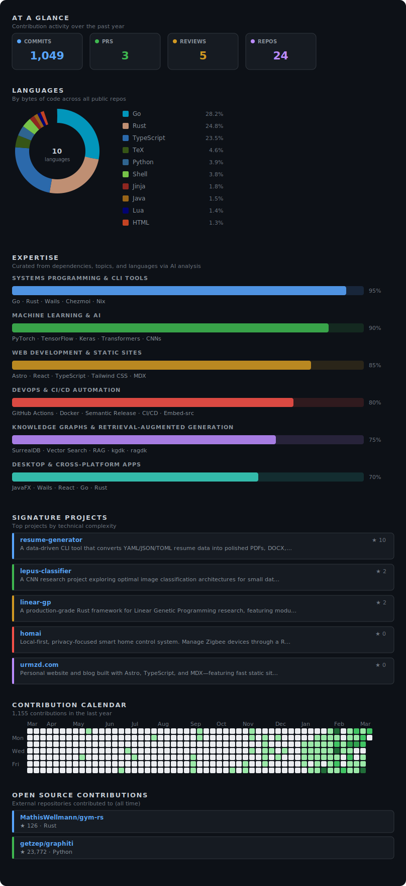

# Urmzd Mukhammadnaim

I build robust, multi-language systems in Go, TypeScript, and Rust—from AI-powered resume generators and privacy-first agents to modular frameworks for genetic programming and knowledge graphs. My work empowers people through automation, local-first apps, and scalable backend solutions.

  

Last generated on 2026-03-17 using [@urmzd/github-insights](https://github.com/urmzd/github-insights)
