<!-- ai-metadata
type: github-profile
name: Urmzd Mukhammadnaim
username: urmzd
languages: [JavaScript, Rust, HTML, Go, Python, TypeScript, Java, Shell, TeX, Lua]
profile: https://github.com/urmzd
-->

# Urmzd Mukhammadnaim

I design full-stack systems from scratch, focusing on scalable AI workflows and agent orchestration—see saige for unified Go SDKs and CLI streaming, or lazyspeak.nvim for seamless Lua/Rust speech-to-code integration. Based in Austin, TX.

**Top Languages:** JavaScript, Rust, HTML, Go, Python

<!-- section: social -->
  

<!-- section: spotlight -->
## Spotlight

### [saige](https://github.com/urmzd/saige)
Super AI Graph Ecosystem: a unified Go SDK and CLI for streaming AI agents, knowledge graphs, and retrieval-augmented generation pipelines, designed for scalable AI workflows.
Languages: Go, Go Template, Shell · **Active**

### [incipit](https://github.com/urmzd/incipit)
Template-driven CLI that transforms structured resume data into polished PDFs, DOCX, HTML, LaTeX, and Markdown, featuring pluggable templates and multi-agent AI assessment. Built in Go with a focus on extensibility and professional output formats.
Stars: 11 · Languages: Go, TeX, HTML · **Active**

### [exp-agi-models](https://github.com/urmzd/exp-agi-models)
Experimental language model exploring algorithm learning over memorization with extreme parameter efficiency—350K params, no embeddings, and every intermediate state readable as words.
Languages: Python, Shell · **Active**

### [linear-gp](https://github.com/urmzd/linear-gp)
Production-grade Rust framework for Linear Genetic Programming research, offering modular architecture, Q-Learning integration, and automated hyperparameter optimization for reinforcement learning and classification tasks.
Stars: 3 · Languages: Rust, Shell, Just · **Active**

### [lazyspeak.nvim](https://github.com/urmzd/lazyspeak.nvim)
Voice-driven coding plugin for Neovim—speak your intent and edits appear in your editor, blending Lua and Rust for seamless speech-to-code integration.
Stars: 1 · Languages: Lua, Rust, Just · **Active**

<!-- section: velocity -->
## Language Velocity

<!-- section: rhythm -->
## Contribution Rhythm

<!-- section: constellation -->
## Project Map

<!-- section: portfolio -->
## Portfolio

All Projects

### Developer Tools

| Project | Description | Stars | Languages |
|---------|-------------|-------|-----------|
| [generative-artifact-protocol](https://github.com/urmzd/generative-artifact-protocol) | Open standard for token-efficient artifact updates and streaming, featuring a Rust apply engine and Python evaluation framework. | - | HTML, Python, Rust |
| [teasr](https://github.com/urmzd/teasr) | Rust-based tool for capturing showcase screenshots and GIFs from web apps, desktop, and terminal—single binary with no runtime dependencies. | - | Rust, HTML, Shell |
| [oag](https://github.com/urmzd/oag) | Fast OpenAPI 3.x code generator for TypeScript, React/SWR, and FastAPI—zero runtime dependencies and first-class SSE streaming support. | - | Rust, Jinja, Shell |
| [github-insights](https://github.com/urmzd/github-insights) | GitHub Action that generates SVG visualizations of GitHub profile metrics, built with JavaScript and TypeScript. | - | JavaScript, TypeScript, Shell |
| [sr](https://github.com/urmzd/sr) | AI-powered release engineering CLI—single binary, language-agnostic, with zero-config defaults and full configurability for streamlined releases. | - | Rust, Shell, Just |
| [lazyspeak.nvim](https://github.com/urmzd/lazyspeak.nvim) | Voice-driven coding plugin for Neovim—speak your intent and edits appear in your editor, blending Lua and Rust for seamless speech-to-code integration. | 1 | Lua, Rust, Just |
| [agentspec](https://github.com/urmzd/agentspec) | Universal agent skill and sub-agent manager with a terminal user interface, written in Rust for flexible agent orchestration. | - | Rust, Shell, Just |
| [incipit](https://github.com/urmzd/incipit) | Template-driven CLI that transforms structured resume data into polished PDFs, DOCX, HTML, LaTeX, and Markdown, featuring pluggable templates and multi-agent AI assessment. Built in Go with a focus on extensibility and professional output formats. | 11 | Go, TeX, HTML |
| [dotfiles](https://github.com/urmzd/dotfiles) | Modern dotfiles managed with Chezmoi and Nix, enabling one-command environment setup for macOS and Linux with Neovim, Tmux, Zsh, and custom development shells. | 2 | Shell, Lua, Go Template |
| [embed-src](https://github.com/urmzd/embed-src) | GitHub Action that syncs code snippets in markdown files with source code during CI/CD, automating documentation updates and reducing manual overhead. | 1 | Rust, Shell, Just |
| [languide](https://github.com/urmzd/languide) | Python CLI that generates scenario-based language learning PDFs with full Unicode/CJK support, tailored for travelers and learners. | - | TeX, Shell |

### SDKs

| Project | Description | Stars | Languages |
|---------|-------------|-------|-----------|
| [saige](https://github.com/urmzd/saige) | Super AI Graph Ecosystem: a unified Go SDK and CLI for streaming AI agents, knowledge graphs, and retrieval-augmented generation pipelines, designed for scalable AI workflows. | - | Go, Go Template, Shell |
| [mnemonist](https://github.com/urmzd/mnemonist) | Open ecosystem for tool-agnostic AI agent memory, providing reusable Rust and Python components for persistent agent state. | - | Rust, Python, Shell |
| [linear-gp](https://github.com/urmzd/linear-gp) | Production-grade Rust framework for Linear Genetic Programming research, offering modular architecture, Q-Learning integration, and automated hyperparameter optimization for reinforcement learning and classification tasks. | 3 | Rust, Shell, Just |
| [gymnasia](https://github.com/urmzd/gymnasia) | Rust rewrite of OpenAI's Gymnasium, offering a fast and type-safe environment toolkit for reinforcement learning research. | - | Rust, Just, Shell |

### Applications

| Project | Description | Stars | Languages |
|---------|-------------|-------|-----------|
| [urmzd.com](https://github.com/urmzd/urmzd.com) | Personal website and blog built with Astro, TypeScript, and MDX, featuring fast static site generation and interactive portfolio components. | 1 | TypeScript, MDX, Astro |
| [zoro](https://github.com/urmzd/zoro) | Privacy-first AI research agent with a persistent knowledge graph—connects ideas and runs all inference locally using Go and Python. | - | Go, Python, Shell |
| [zigbee-skill](https://github.com/urmzd/zigbee-skill) | Local-first, privacy-focused smart home control system for managing Zigbee devices via a REST API without cloud dependencies, built in Go. | - | Go, Just, Shell |
| [fighter-iq](https://github.com/urmzd/fighter-iq) | AI-powered strategy analysis for combat sports video, identifying tactics and strategies from fight footage using Python. | - | Python, Just |
| [urmzd](https://github.com/urmzd/urmzd) | GitHub profile README repository. | - | - |

### Research & Experiments

| Project | Description | Stars | Languages |
|---------|-------------|-------|-----------|
| [exp-agi-models](https://github.com/urmzd/exp-agi-models) | Experimental language model exploring algorithm learning over memorization with extreme parameter efficiency—350K params, no embeddings, and every intermediate state readable as words. | - | Python, Shell |
| [rlgp-thesis](https://github.com/urmzd/rlgp-thesis) | Undergraduate thesis on Reinforced Linear Genetic Programming, presented in TeX with supporting scripts. | - | TeX, Shell |

<!-- section: impact -->
## Open Source Impact

<!-- section: footer -->
Last generated on 2026-04-04 using [@urmzd/github-insights](https://github.com/urmzd/github-insights)
