<!-- ai-metadata
type: github-profile
name: Urmzd Mukhammadnaim
username: urmzd
languages: [Go, Rust, TypeScript, Python, Java, TeX, Shell, JavaScript, MDX, Jinja]
profile: https://github.com/urmzd
-->

# Hi, I'm Urmzd 👋

I build robust systems and AI tools in Go, Rust, and TypeScript—from template-driven resume generators and privacy-first agents to advanced genetic programming frameworks and efficient language models. My work empowers people with scalable, local-first solutions and deep technical insight.

**Top Languages:** Go, Rust, TypeScript, Python, Java

<!-- section: social -->
  

<!-- section: projects -->
### Developer Tools

| Project | Description | Stars | Languages |
|---------|-------------|-------|-----------|
| [oag](https://github.com/urmzd/oag) | Oag is a Rust-based OpenAPI 3.x code generator for TypeScript, React/SWR, and FastAPI, featuring zero runtime dependencies and support for SSE streaming. | - | Rust, Jinja, Shell |
| [sr](https://github.com/urmzd/sr) | Sr is an AI-powered release engineering CLI written in Rust, providing language-agnostic, zero-config defaults for automating the release process. | - | Rust, Shell, Just |
| [github-insights](https://github.com/urmzd/github-insights) | Github-insights is a GitHub Action written in TypeScript that generates SVG visualizations of GitHub profile metrics. | - | TypeScript, Shell |
| [incipit](https://github.com/urmzd/incipit) | Incipit is a template-driven CLI written in Go that transforms structured resume data into polished documents in various formats, featuring pluggable templates and multi-agent AI assessment. | 10 | Go, TeX, HTML |
| [dotfiles](https://github.com/urmzd/dotfiles) | Dotfiles is a collection of modern configuration files using Chezmoi and Nix for bootstrapping development environments on macOS and Linux, including Neovim, Tmux, Zsh, and specialized shells. | 2 | Shell, Lua, Go Template |
| [languide](https://github.com/urmzd/languide) | Languide is a Python CLI that generates scenario-based language learning PDFs with full Unicode/CJK support, covering topics for travelers and language learners. | - | Python, TeX, Shell |
| [embed-src](https://github.com/urmzd/embed-src) | Embed-src is a GitHub Action written in Rust that syncs code snippets in markdown files with source code, automating documentation updates during CI/CD. | 1 | Rust, Shell, Just |
| [gitit](https://github.com/urmzd/gitit) | Gitit is a Rust CLI tool that generates AI-powered git commands, including atomic conventional commits, code reviews, branch names, and PR descriptions using Claude or Gemini. | - | Rust, Shell, Just |

### SDKs

| Project | Description | Stars | Languages |
|---------|-------------|-------|-----------|
| [saige](https://github.com/urmzd/saige) | Saige is a unified Go SDK and CLI for streaming AI agents, knowledge graphs, and RAG pipelines, supporting integration with various AI workflows. | - | Go, Go Template, Shell |
| [lightning-kfold](https://github.com/urmzd/lightning-kfold) | Lightning-kfold is a Python library providing stratified K-fold cross-validation with ensemble voting for PyTorch Lightning. | - | Python |

### Applications

| Project | Description | Stars | Languages |
|---------|-------------|-------|-----------|
| [urmzd.com](https://github.com/urmzd/urmzd.com) | Urmzd.com is a personal website and blog built with Astro, TypeScript, and MDX, featuring fast static site generation and interactive content components. | 1 | TypeScript, MDX, CSS |
| [zoro](https://github.com/urmzd/zoro) | Zoro is a privacy-first AI research agent with a persistent knowledge graph, running all inference locally and supporting multiple languages including TypeScript, Go, and Python. | - | TypeScript, Go, Python |
| [teasr](https://github.com/urmzd/teasr) | Teasr is a Rust application for capturing showcase screenshots and GIFs from web apps, desktop, and terminal, distributed as a single binary with no runtime dependencies. | - | Rust, Shell, HTML |
| [zigbee-rest](https://github.com/urmzd/zigbee-rest) | Zigbee-rest is a Go-based smart home control system that manages Zigbee devices through a REST API, focusing on privacy and local-first operation. | - | Go, Just, Shell |
| [urmzd](https://github.com/urmzd/urmzd) | Urmzd is a GitHub profile README repository, used for displaying profile information. | - | - |
| [barter-trader](https://github.com/urmzd/barter-trader) | Barter-trader is an Android trading app built with Java, Clean Architecture, and MVVM, enabling peer-to-peer item exchanges with enterprise-grade mobile development patterns. | - | Java, Shell, Nix |

### Research & Experiments

| Project | Description | Stars | Languages |
|---------|-------------|-------|-----------|
| [exp-agi-models](https://github.com/urmzd/exp-agi-models) | Exp-agi-models is a Python research project exploring parameter-efficient language models that learn algorithms, with all intermediate states readable as words. | - | Python, Shell |
| [rlgp-thesis](https://github.com/urmzd/rlgp-thesis) | Rlgp-thesis is an MSc thesis project focused on Reinforced Linear Genetic Programming, utilizing TeX and Shell for documentation. | - | TeX, Shell |
| [linear-gp](https://github.com/urmzd/linear-gp) | Linear-gp is a Rust framework for Linear Genetic Programming research, supporting modular architecture, Q-Learning integration, and automated hyperparameter optimization for reinforcement learning and classification tasks. | 3 | Rust, Just, Shell |
| [lepus-classifier](https://github.com/urmzd/lepus-classifier) | Lepus-classifier is a CNN research project using Jupyter Notebook and Python to explore optimal image classification architectures for small datasets. | 2 | Jupyter Notebook, Python, Shell |
| [md-classifier](https://github.com/urmzd/md-classifier) | Md-classifier is a deep learning system combining transformers and CNNs in Python and Jupyter Notebook to classify diseases from patient-described symptoms using semantic embeddings. | 2 | Jupyter Notebook, Python, Shell |
| [flappy-bird](https://github.com/urmzd/flappy-bird) | Flappy Bird is a JavaFX clone demonstrating data-oriented design patterns and cross-platform desktop development, with automated native builds for Linux, macOS, and Windows. | 4 | Java, Just |
| [chess-cli](https://github.com/urmzd/chess-cli) | Chess-cli is a Python command-line chess game with object-oriented design, suitable for learning game logic, exploring chess AI algorithms, or playing from the terminal. | 3 | Python, Just |
| [cypress-name-too-long-mre](https://github.com/urmzd/cypress-name-too-long-mre) | Cypress-name-too-long-mre is a minimal reproducible example using JavaScript, HTML, and CSS, likely for testing or demonstration purposes. | - | JavaScript, HTML, CSS |

<!-- section: visualizations -->
## Project Map

## GitHub Stats

## Open Source Impact

<!-- section: footer -->
Last generated on 2026-03-25 using [@urmzd/github-insights](https://github.com/urmzd/github-insights) · Template: `ecosystem`
