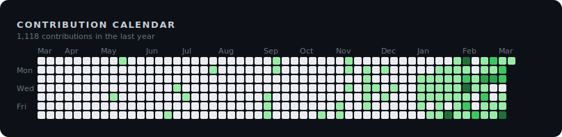

# Hi, I'm Urmzd 👋

I build robust, multi-language systems in Go, TypeScript, and Rust—from AI-powered resume generators and privacy-first agents to modular frameworks for genetic programming and knowledge graphs. My work empowers people through automation, local-first apps, and scalable backend solutions.

  

## Active Projects

### [urmzd.com](https://github.com/urmzd/urmzd.com)
A personal website and blog built with Astro, TypeScript, and MDX, featuring fast static site generation and interactive components for content and portfolio.
TypeScript, MDX, CSS

### [resume-generator-app](https://github.com/urmzd/resume-generator-app)
A native desktop application for building resumes with live PDF preview, template gallery, and inline editing. Built with Wails, React, and Tailwind CSS, it supports multiple file formats.
TypeScript, TeX, HTML

### [zoro](https://github.com/urmzd/zoro)
A privacy-first AI research agent with a persistent knowledge graph, enabling local inference and idea management. Built with TypeScript, Go, Python, and other technologies.
TypeScript, Go, Python

### [oag](https://github.com/urmzd/oag)
A fast OpenAPI 3.x code generator written in Rust, supporting TypeScript, React/SWR, and FastAPI. It offers zero runtime dependencies and first-class SSE streaming.
Rust, Jinja, Shell

### [sr](https://github.com/urmzd/sr)
A Rust CLI tool for trunk-based semantic release, supporting conventional commits, changelog generation, git tags, and GitHub releases. It streamlines release management for Rust projects.
Rust, Shell, Just

### [teasr](https://github.com/urmzd/teasr)
A Rust-based tool for capturing showcase screenshots and GIFs from web apps, desktop, and terminal environments. It is distributed as a single binary with no runtime dependencies.
Rust, Shell

### [adk](https://github.com/urmzd/adk)
A strongly-typed Go SDK for building streaming LLM agent loops, supporting conversation trees, tool registry, sub-agents, compaction, embeddings, and pluggable providers.
Go

### [gitit](https://github.com/urmzd/gitit)
A Rust CLI tool that provides AI-powered git commands, generating atomic conventional commits, code reviews, branch names, and PR descriptions using Claude or Gemini. It features two-tier caching for fast repeat runs.
Rust, Shell, Just

### [ragdk](https://github.com/urmzd/ragdk)
A Go library for multi-modal Retrieval-Augmented Generation (RAG) with graph-enhanced retrieval, supporting document hierarchies, pluggable extractors, vector search, and kgdk integration.
Go

### [github-insights](https://github.com/urmzd/github-insights)
A GitHub Action written in TypeScript that generates SVG visualizations of GitHub profile metrics. It automates the creation of graphical insights for user profiles.
TypeScript

### [lightning-kfold](https://github.com/urmzd/lightning-kfold)
A Python library providing stratified K-fold cross-validation with ensemble voting for PyTorch Lightning. It is designed for easy integration into machine learning workflows.
Python

### [kgdk](https://github.com/urmzd/kgdk)
A Go SDK for building and querying knowledge graphs, featuring a SurrealDB backend, entity extraction pipeline, vector search, and a pluggable Graph interface.
Go

## Maintained Projects

### [resume-generator](https://github.com/urmzd/resume-generator)
A CLI tool written in Go that converts resume data in YAML, JSON, or TOML formats into polished PDFs, DOCX, HTML, LaTeX, and Markdown. It features multi-agent AI assessment via Ollama and supports multiple output formats.
★ 10 · Go, TeX, HTML

### [linear-gp](https://github.com/urmzd/linear-gp)
A Rust framework for Linear Genetic Programming research, featuring modular architecture, Q-Learning integration, automated hyperparameter optimization, and support for reinforcement learning and classification tasks.
★ 2 · Rust, TeX, Shell

### [zigbee-rest](https://github.com/urmzd/zigbee-rest)
A local-first, privacy-focused smart home control system written in Go, allowing management of Zigbee devices through a REST API without cloud dependencies.
Go, Just, Shell

### [dotfiles](https://github.com/urmzd/dotfiles)
A collection of modern dotfiles managed with Chezmoi and Nix, enabling one-command environment bootstrap for macOS and Linux. It includes configurations for Neovim, Tmux, Zsh, and specialized development shells.
★ 2 · Shell, Lua, Go Template

### [languide](https://github.com/urmzd/languide)
A Python CLI that generates practical, scenario-based language learning PDFs with full Unicode and CJK support. It covers topics like restaurants, hotels, and transportation for travelers and language learners.
Python, TeX, Shell

### [flappy-bird](https://github.com/urmzd/flappy-bird)
A Flappy Bird clone built with JavaFX and Java 21, showcasing data-oriented design patterns and cross-platform desktop development. It includes automated native builds for Linux, macOS, and Windows.
★ 4 · Java, Just

### [chess-cli](https://github.com/urmzd/chess-cli)
A fully playable chess game implemented in Python with object-oriented design and a command-line interface. It is suitable for learning game logic, exploring chess AI algorithms, or playing from the terminal.
★ 3 · Python, Just

### [embed-src](https://github.com/urmzd/embed-src)
A GitHub Action written in Rust and Shell that automatically syncs code snippets in markdown files with source code. It helps keep documentation up-to-date during CI/CD workflows.
★ 1 · Rust, Shell

### [urmzd](https://github.com/urmzd/urmzd)
A GitHub profile README repository, used for displaying profile information and updates. It is auto-generated and maintained for user presentation.

## Inactive Projects

### [lessons](https://github.com/urmzd/lessons)
A repository of archived projects with retrospectives detailing successes, failures, and lessons learned. It uses TypeScript, JavaScript, CSS, and HTML.
TypeScript, JavaScript, CSS

## GitHub Stats

## Other Areas of Interest

Last generated on 2026-03-17 using [@urmzd/github-insights](https://github.com/urmzd/github-insights)
