<!-- ai-metadata
type: github-profile
name: Urmzd Mukhammadnaim
username: urmzd
languages: [Go, Rust, TypeScript, Python, Java, TeX, Shell, JavaScript, Jinja, Lua]
profile: https://github.com/urmzd
-->

# Hi, I'm Urmzd 👋

I build robust, multi-language systems in Go, Rust, and TypeScript—from AI-powered resume tools and privacy-first research agents to scalable smart home and AGI experiments. My work focuses on empowering people with open, local-first tech and practical automation.

**Top Languages:** Go, Rust, TypeScript, Python, Java

<!-- section: social -->
  

<!-- section: projects -->
## Active Projects

### [incipit](https://github.com/urmzd/incipit)
A template-driven CLI written in Go that transforms structured resume data into polished documents (PDF, DOCX, HTML, LaTeX, Markdown) with pluggable templates and multi-agent AI assessment.
Stars: 10 · Languages: Go, TeX, HTML

### [urmzd.com](https://github.com/urmzd/urmzd.com)
A personal website and blog built with Astro, TypeScript, and MDX, featuring fast static site generation and interactive components for content and portfolio.
Languages: TypeScript, MDX, CSS

### [exp-agi-models](https://github.com/urmzd/exp-agi-models)
A Python project exploring extreme parameter efficiency in language models, investigating whether a model can learn algorithms instead of memorizing patterns with 350K parameters and readable intermediate states.
Languages: Python, Shell

### [saige](https://github.com/urmzd/saige)
A unified Go SDK and CLI for streaming AI agents, knowledge graphs, and RAG pipelines, supporting integration and orchestration of AI workflows.
Languages: Go, Go Template, Shell

### [zoro](https://github.com/urmzd/zoro)
A privacy-first AI research agent built with TypeScript, Go, and Python, featuring a persistent knowledge graph and local inference for connecting ideas securely.
Languages: TypeScript, Go, Python

### [teasr](https://github.com/urmzd/teasr)
A Rust-based tool for capturing showcase screenshots and GIFs from web apps, desktop, and terminal, distributed as a single binary with no runtime dependencies.
Languages: Rust, Shell, HTML

### [oag](https://github.com/urmzd/oag)
A fast OpenAPI 3.x code generator written in Rust for TypeScript, React/SWR, and FastAPI, offering zero runtime dependencies and first-class SSE streaming support.
Languages: Rust, Jinja, Shell

### [sr](https://github.com/urmzd/sr)
A Rust CLI for trunk-based semantic release, supporting conventional commits, changelog generation, git tags, and GitHub releases.
Languages: Rust, Shell, Just

### [github-insights](https://github.com/urmzd/github-insights)
A GitHub Action written in TypeScript that generates SVG visualizations of GitHub profile metrics for enhanced repository insights.
Languages: TypeScript, Shell

## Maintained Projects

### [linear-gp](https://github.com/urmzd/linear-gp)
A Rust framework for Linear Genetic Programming research, featuring modular architecture, Q-Learning integration, automated hyperparameter optimization, and support for reinforcement learning and classification tasks.
Stars: 3 · Languages: Rust, TeX, Shell

### [zigbee-rest](https://github.com/urmzd/zigbee-rest)
A local-first smart home control system written in Go, providing privacy-focused management of Zigbee devices through a REST API without cloud dependencies.
Languages: Go, Just, Shell

### [dotfiles](https://github.com/urmzd/dotfiles)
Modern dotfiles managed with Chezmoi and Nix, providing one-command environment bootstrap for macOS and Linux, including Neovim, Tmux, Zsh, and specialized development shells.
Stars: 2 · Languages: Shell, Lua, Go Template

### [languide](https://github.com/urmzd/languide)
A Python CLI that generates scenario-based language learning PDFs with full Unicode/CJK support, covering practical topics for travelers and language learners.
Languages: Python, TeX, Shell

### [embed-src](https://github.com/urmzd/embed-src)
A GitHub Action written in Rust that automatically syncs code snippets in markdown files with source code, keeping documentation up-to-date during CI/CD.
Stars: 1 · Languages: Rust, Shell, Just

### [urmzd](https://github.com/urmzd/urmzd)
A GitHub profile README repository for personal branding and information display.

<!-- section: visualizations -->
## Project Map

## GitHub Stats

## Open Source Impact

<!-- section: footer -->
Last generated on 2026-03-24 using [@urmzd/github-insights](https://github.com/urmzd/github-insights) · Template: `modern`
